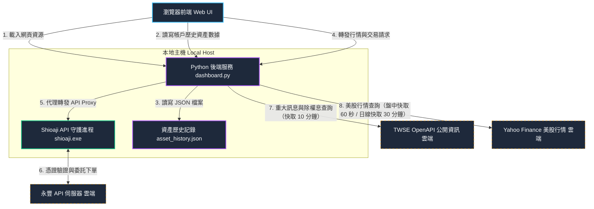

# StockGenie

本專案為基於永豐證券 API 所建置的股票交易與資產監控儀表板，只保留必要看盤及下單等功能，維持畫面簡潔易用，擁有安全鎖與自訂確認彈窗雙重保障，防止任何下單交易誤會。

v1.4 起聚焦證券帳戶（期貨功能退場），並強化辦公室防窺體系：一鍵隱私遮蔽（Boss Key）、終端機日誌看盤模式（Terminal Log Mode）、駭客任務 Matrix 顯示風格，以及 TWSE 重大訊息與除權息行事曆看板、已實現月度損益圖表、歷史數據匯出/匯入安全校驗等功能。

v1.5 起新增「美股自選監控」獨立分頁：透過後端代理 Yahoo Finance 公開行情（延遲約 15 分鐘、免 API 金鑰），支援任意美股代碼（指數/個股/ETF）的新增、移除、排序與 localStorage 持久化，並提供與台股自選一致的明細面板（開高低收、MA5/20/60/240、分時與均線圖表）。

---

## 🔌 技術基礎與永豐 API 整合
本專案的行情與交易下單核心完全基於永豐金證券推出的開源 Python 交易套件 **[Shioaji](https://github.com/Sinotrade/Shioaji)**。
本系統透過本地端執行 `shioaji.exe` 的 daemon 守護進程，並由 `dashboard.py` 提供一個極簡且高安全性的 Web Proxy 代理通道，串接網頁前端與 Shioaji SDK 的實體運作。

---

## 🏗️ 系統架構圖 (System Architecture)
本系統採用「瀏覽器前端 (Web UI)」、「本地 Python 伺服器 (Web Proxy & Backend)」以及「Shioaji 守護進程 (Shioaji Daemon)」的三層式架構：

---

## 📂 文件導覽與快速跳轉連結

* 📖 **[專案操作與使用手冊 (walkthrough.md)](./walkthrough.md)**：
  * **內容**：包含詳細的環境配置（`.env`）、啟動步驟、防窺配色切換、歷史數據手動補錄以及安全下單機制的詳細操作指引。
* 📐 **[設計規格書 (dashboard_design.md)](./dashboard_design.md)**：
  * **內容**：詳細記錄專案的防窺配色原則、佈局架構設計、CORS 反向代理同源通訊規避手段、多執行緒併發設計原則。
* 🔍 **[全面代碼評審報告 (code_review.md)](./code_review.md)**：
  * **內容**：由資深架構師對專案在多執行緒併發、子進程 lifecycle 生命週期管理（防止緩衝區死鎖）、前端 Robustness 數據防禦性編程等角度做出的深入 Code Review 報告與未來迭代優化建議。
* 📝 **[任務清單 (task.md)](./task.md)**：
  * **內容**：開發階段各項功能調試、中文化細修與漏洞修正的完整檢核進度表（全數通過）。

---

## 🗂️ 專案實體代碼結構

* 🚀 **[啟動儀表板.bat](./啟動儀表板.bat)**：雙擊即可一鍵啟動後端代理伺服器與 Shioaji API。
* 🐍 **[dashboard.py](./dashboard.py)**：Python 後端。提供靜態資源、`/proxy/` 反向代理（含 `profit_loss` 預設 365 天參數補充、上游錯誤排障日誌、帳務端點 30 秒等待）、`/api/asset-history` 歷史資產讀寫（含匯入嚴格校驗與 `.bak` 備份）、`/api/twse-announcements` 與 `/api/twse-dividends` TWSE 公開資訊查詢（快取 10 分鐘、自動處理 TWSE 憑證鏈問題）、`/api/us-chart` 美股行情 Yahoo Finance 代理（代碼格式驗證、盤中快取 60 秒/日線快取 30 分鐘、gzip 壓縮傳輸），並於啟動時預檢 CA 憑證存在性。
* 🖥️ **[web/index.html](./web/index.html)**：前端網頁結構，包含自訂確認 Modal、Boss Key / Terminal Mode 切換鈕、T+2 警戒條、卡片顯示設定表單、終端機日誌 Overlay。
* 🎨 **[web/style.css](./web/style.css)**：外觀樣式表（含 Slate / Stealth / Muted / **Matrix** 四種配色變數、遮蔽模式與終端機 Overlay 樣式）。
* ⚙️ **[web/app.js](./web/app.js)**：網頁交互邏輯。並行帳務輪詢、Canvas 圖表（資產趨勢 / 已實現月度損益 / 分時 / 均線 / Sparkline）、Boss Key 與 Terminal Mode 隱私防護、鍵盤快捷鍵（Esc / 雙擊 Space）、自選 20 檔上限與每 10 檔分批快照、委買賣力道條、TWSE 看板渲染、JSON 匯出匯入。
* 📡 **[持倉監控.bat](./持倉監控.bat)** / **[monitor.py](./monitor.py)**：獨立的控制台彩色持倉輪詢監控工具。v1.3.0 起，登入後 session 等待改為主動輪詢就緒，取代固定 sleep(8)。
* 🔬 **[sdk_probe.py](./sdk_probe.py)**：SDK 層帳務診斷腳本。當懷疑永豐後台異常時，先關閉儀表板再執行 `python sdk_probe.py`，可區分「toolkit 問題」與「帳號/永豐後台問題」。

---

## ⚡ 快速啟動指引

1. **配置環境**：
   確保工作區根目錄下的 **[.env](./.env)** 檔案內配置了正確的永豐 API 密鑰、憑證路徑及密碼。
2. **雙擊啟動**：
   雙擊執行 **[啟動儀表板.bat](./啟動儀表板.bat)**。系統偵測到 Shioaji API 伺服器就緒後，會自動在您的預設瀏覽器中開啟 `http://127.0.0.1:8081`（通常在 10 秒內，最多等待 30 秒）。
3. **優雅停止**：
   在 CMD 控制台視窗中按下 `Ctrl + C`，系統將會優雅安全地中止背景運行的 `shioaji.exe` 伺服器並釋放 Port `8080` 與 `8081`。

---

## ⚠️ 系統開發與版本更動守則

為了落實專案的追蹤與管理，本專案特別制定以下規範：
* **版本號同步更新限制**：未來在進行任何系統功能升級、修補 bug 或修改程式碼時，**版本號必須同步跟著更新**（目前版本為 `v1.5.1`）。請在修改完成後，主動更新：
  1. [index.html](./web/index.html) 的頁尾 Footer 版本標籤。
  2. 本 [README.md](./README.md) 的版本表記與指引說明。

---

## 📋 版本更新紀錄

### 📅 2026-06-10 (v1.5.0 至 v1.5.1)

* **v1.5.1** - **跨分頁行情輪詢降頻**：
  * **美股分頁時台股快照暫停**：停留在「美股指數」分頁期間，暫停台股自選快照輪詢以節省 Shioaji 行情 API 額度；餘額、庫存、交割款等帳務查詢與 T+2 警示**照常運作**。
  * **切回即時補抓**：離開美股分頁時立即補抓一次台股自選快照，避免最長 15 秒的舊報價顯示。

* **v1.5.0** - **美股自選監控分頁**：
  * **獨立「美股指數」分頁**：側邊欄新增地球圖示分頁，與台股自選完全分離。免 API 金鑰，透過後端 `/api/us-chart` 代理 Yahoo Finance 公開 chart API 取得行情（延遲約 15 分鐘，行情卡片上有明確標註）。
  * **任意代碼自選管理**：搜尋框輸入任意美股代碼（如 `AAPL`、`QQQ`、`BRK-B`、`^DJI`）即可加入監控，商品名稱自動帶入；支援 ▲▼ 排序、明細卡垃圾桶移除，清單存於 localStorage（`usWatchlist`），預設帶入 `^GSPC` 與 `VOO`，上限 20 檔。
  * **完整明細面板**：比照台股自選提供昨收、開高低收、成交量、MA5/20/60/240 數值格，以及分時走勢圖（5 分 K）與均線走勢圖（2 年日線，顯示近 1 年）雙 tab 圖表，繪圖風格與台股一致（含 Matrix / Stealth 配色適配與 Boss Key 遮蔽）。
  * **指數與個股樣式區分**：依 Yahoo `instrumentType` 判別（行情未載入時以 `^` 前綴回退判斷），指數套用淡灰底專屬樣式，與台股 `IND` 處理邏輯對齊。
  * **後端安全與快取設計**：商品代碼採格式驗證（1-12 字元，限大寫字母/數字/`.^-=`，小寫自動轉大寫），僅代理固定查詢組合（盤中 `1d/5m` 快取 60 秒、日線 `2y/1d` 快取 30 分鐘），不構成開放代理；查無代碼回 404、非法格式回 400、上游失敗回退快取舊資料。
  * **流量節約輪詢**：美股行情每 60 秒輪詢一次，且僅在「美股指數」分頁開啟時運作；切換至其他分頁或網頁進入背景（Page Visibility）即自動停止。
  * **漲跌徽章格式統一**：台股與美股的個股、ETF 漲跌徽章升級為與指數相同的「漲跌點數 (漲跌百分比)」雙顯示格式（如 `+13.50 (+1.26%)`），價格區塊寬度由 80px 統一加寬至 140px 防止折行。
  * **台股 tab 綁定範圍修正**：原分時/均線 tab 切換為全域綁定 `.detail-tab`，現限定於 `#view-watchlist` 範圍，避免與美股分頁的同名元件互相干擾（台股行為不變）。

### 📅 2026-06-10 (v1.4.0 至 v1.4.6)

* **v1.4.6** - **移除安全驗證問題提示標籤**：
  * **問題提示隱蔽化**：調整畫面格式。

* **v1.4.5** - **系統設定防護驗證機制**：
  * **進入設定問答攔截**：當使用者點選側邊欄的「系統設定」圖示時，將攔截直接進入，並彈出磨砂玻璃效果的「系統安全驗證」對話框。
  * **隨機洗牌問答選項**：使用者必須回答問題，系統會動態隨機生成 5 個符合 `[A-Z]{3}[0-9]{1}` 格式的錯誤答案，並將 6 個選項進行隨機洗牌，答對後才能進入，否則會彈出錯誤警告阻斷，提升系統在辦公室的防窺安全性。

* **v1.4.4** - **Page Visibility 流量與效能優化、TWSE 下載壓縮**：
  * **背景輪詢自動暫停**：引入 Page Visibility API。當使用者切換瀏覽器分頁、將網頁最小化或鎖定螢幕使網頁處於 `hidden` 背景狀態時，自動停止所有帳務與自選行情輪詢，並清除計時器；回到分頁時自動重啟，大幅節省辦公室閒置時的背景頻寬流量、CPU 消耗與永豐 API 額度。
  * **TWSE 資料傳輸壓縮**：後端 `/twse-announcements` 與 `/twse-dividends` 在請求 TWSE OpenAPI 時加入 `Accept-Encoding: gzip` 請求頭，並實作 gzip 自動解壓縮，減少了 80% 以上的遠端網路傳輸量，使重大訊息與除權息公告抓取更流暢。

* **v1.4.3** - **歷史資產備份與 TWSE 併發警告修正**：
  * **歷史資料備份過期清理修正**：限制過期清理僅在資產歷史總筆數大於 1000 筆時才啟動，並將過期清理範圍放寬至 365 天，防止手動導入或回填的歷史舊資料被每日自動存檔（POST）時截斷。
  * **TWSE 憑證警告鎖定保護**：對 TWSE 憑證降級警告加上 `_twse_cache_lock` 鎖定保護，防止高頻併發請求時重複輸出警告訊息。

* **v1.4.2** - **Matrix 顯示風格與損益圖優化**：
  * **駭客任務 The Matrix 風格**：新增第四種配色方案——純黑底、螢光綠字、數值輝光，所有 Canvas 圖表同步綠化。此風格**僅支援暗色背景**：選用時強制 dark 主題並鎖定主題切換按鈕（hover 顯示原因），切回其他風格自動還原原本的主題偏好。
  * **損益圖每月金額**：已實現月度損益 bar 上直接標示每月金額（正值在上、負值在下）。
  * **主題切換重繪修正**：主題/配色切換時同步重繪損益圖，修正淺色背景下舊色 bar 隱形的問題。

* **v1.4.1** - **效能並行與排障強化**：
  * **帳務 API 並行化**：`fetchData` 的餘額/額度/庫存/交割款由序列 await 改為 `Promise.allSettled` 並行，行情快照不再被帳務查詢卡住；永豐後台緩慢時，首屏等待由「各支相加」縮短為「最慢一支」。
  * **自選快照即時補打**：清單初始化完成後立即查詢快照，開頁即有報價（原需等下一輪輪詢 15 秒）。
  * **TWSE 憑證鏈修正**：TWSE OpenAPI 憑證缺 Subject Key Identifier 導致驗證失敗，自動降級寬鬆 SSL 並記住狀態（僅首次慢一輪）。
  * **Proxy 排障日誌**：上游錯誤與逾時印出詳細原因至終端機；帳務端點等待上限 10s → 30s。

* **v1.4.0** - **14 項核心功能與安全變更**：
  * **期貨功能全面退場**：移除期貨卡片、部位表格與相關輪詢，專注證券帳戶。
  * **新總覽卡片**：「庫存證券總市值」與「總資產（現金餘額 + 證券市值）」。
  * **T+2 違約交割缺口警示**：交割款逐日累計後預估餘額 < 0 時顯示橘黃警戒條與缺口金額。
  * **Boss Key 一鍵隱私遮蔽**（`Esc` 或 Header 按鈕）：金額以 `*****` 遮蔽、所有 Canvas 清空印 `[DATA MASKED]`，防止由波形反推資產。
  * **Terminal Log Mode**（雙擊 `Space` 或 Header 按鈕）：黑底綠字伺服器日誌偽裝畫面，行情與損益化為 heartbeat 訊息；雙擊空白鍵已阻斷網頁滾動跳動。
  * **資訊總覽卡片自訂顯示**：設定面板勾選 9 張卡片開關，持久化於 `localStorage`。
  * **盤中委買委賣力道條**：個股明細以快照最佳一檔委買/委賣張數顯示買方力道比例。
  * **已實現月度損益圖**：後端 Proxy 自動補前 365 天參數，前端按月聚合繪製條形圖。
  * **TWSE 看板**：自選股重大訊息日誌與除權息行事曆（後端快取 10 分鐘，每 10 分鐘更新）。
  * **歷史數據匯出/匯入**：匯出 JSON 備份；匯入經後端嚴格 Schema 校驗（整批通過才寫入，校驗邏輯通過 15 項單元測試）。
  * **自選股流量優化**：上限 20 檔，快照每 10 檔分批查詢。
  * **後端強化**：CA 憑證啟動預檢警告；歷史清理 90 天但至少保留 10 筆。

---

### 📅 2026-06-10 (v1.3.18 至 v1.3.25)

* **v1.3.25** - **快取停用防禦與對比度深度修正**：
  * **徹底停用靜態快取**：為解決瀏覽器快取舊網頁與樣式導致的排版異常，後端 Python 伺服器 `DashboardHandler` 新增了 Cache-Control 防快取標頭，確保每次重新整理網頁時皆能 100% 載入最新檔案。
  * **黑白按鈕與 Tab 懸停對比度修正**：修正了「隱形黑白模式」下，白底按鈕與 active/hovered 狀態下的分時/均線切換 Tab 文字顏色為 `var(--bg-primary)`（極簡黑色），避免白底白字重疊消失。
  * **「顯示走勢圖」更名**：將自選監控標題旁的開關文字修改為更切合使用者語意的「顯示趨勢圖」，並加上浮動提示框說明其省流量效能。
  * **移除行內樣式衝突**：移成了訂單確認送出按鈕 `#btn-confirm-submit` 的冗餘行內樣式，防止干擾 CSS 主題覆寫。
  * **專案全面更名**：將專案名稱全面由 "SinoPac Genie" 改為 "StockGenie"。

* **v1.3.24** - **微型趨勢圖開關與按鈕對比度修正**：
  * **「顯示走勢圖」開關與效能優化**：自選清單標題旁新增「顯示走勢圖」Toggle 開關（預設為關閉，狀態持久化於 `localStorage`）。關閉時，卡片不渲染 Canvas 畫布，也免除微型折線繪製，以節省瀏覽器渲染負載、網路流量與 CPU 負荷。
  * **隱形黑白按鈕對比度修正**：修正了 stealth 配色下部分以 `--color-accent` 為背景的按鈕字體偏白導致文字看不見的問題，強制指定文字顏色為 `var(--bg-primary)`。

* **v1.3.23** - **隱形黑白模式配色對比度修正**：
  * **指數徽章背景對比修正**：修正「隱形黑白模式」下加權大盤指數卡片底色與漲跌幅徽章背景色重疊融合成一片的問題，將指數徽章背景強制指定為相對深色的 `--bg-secondary`，以提升易讀性與視覺層次。

* **v1.3.22** - **自選指數商品卡片結構對稱優化**：
  * **下單按鈕佔位對齊**：在無下單按鈕的大盤指數卡片最右側引入 `watchlist-order-btn-placeholder` 佔位元素（寬度為 `42px`），解決了其價格區塊偏向最右側、與普通股票垂直線無法對齊的問題。

* **v1.3.21** - **自選股響應式排版對齊優化**：
  * **微型走勢圖置中排版**：限制股票名稱寬度，並將走勢圖（Sparkline）設為 `flex: 1`（最大寬度為 `160px`）搭配 `margin-left: auto` 彈性推開價格區塊，解決寬螢幕下走勢圖擠在最右邊及中間大片空白的缺點。
  * **視窗縮放即時重繪**：新增視窗 resize 事件防禦性監聽器，視窗大小改變時自動在 150ms 後 debounce 重新繪製微型走勢圖，避免拉伸變形。

* **v1.3.20** - **自選排序與大盤顯示優化**：
  * **自選清單自訂排序**：自選股卡片最左側新增微型的上移（▲）與下移（▼）箭頭按鈕，排序結果可即時在清單中上下互換項目順序，並持久化至 `localStorage`。
  * **大盤卡片專屬配色**：針對指數商品（`IND`），自動為卡片套用淡灰底色樣式（使用 `--bg-tertiary`）。
  * **即時漲跌點數顯示**：大盤加權指數的漲跌幅徽章改為同時顯示「目前漲跌點數 (漲跌百分比)」（例如 `+150.25 (+0.82%)`），並將區塊寬度擴展至 `140px` 以防止折行跑版。

* **v1.3.19** - **大盤指數監控支援**：
  * **動態 Security Type 適配**：支援大盤加權指數 `TSE001` (或代碼 `001`) 監控，自動以 `IND` (指數) 商品類別查詢。
  * **自選清單交易限制**：當監控商品為指數 (`IND`) 時，自動隱藏「下單」按鈕。
  * **全方位圖表支援**：大盤加權指數的分時圖、日 K 線圖與 MA 均線指標均能完整載入與流暢繪製。

* **v1.3.18** - **介面響應式排版優化**：
  * **響應式天區收縮**：當瀏覽器視窗縮小時，自動隱藏系統標題（StockGenie）與連線狀態文字（僅留下運作燈號與倒數時鐘），釋放大量水平空間。
  * **防止文字折行**：為標題、連線狀態及倒數計時增加 `white-space: nowrap`，防止小寬度下產生的文字折行。

---

### 📅 2026-06-09 (v1.3.16 與 v1.3.17)

* **v1.3.17** - **安全性增強**：
  * **唯讀金鑰安全檢核與攔截**：按下下單按鈕時自動檢核是否有下單權限，若無權限，在前端顯示「下單權限關閉」。
  * **雙重安全檢核機制**：
    * 前端：開單時檢查 `state.tradingPermitted`，若無權限則跳出提示並阻斷下單抽屜開啟。
    * 後端：在 API 代理層（`/proxy/api/v1/order/place_order`）攔截下單請求。若金鑰屬唯讀金鑰，主動拒絕交易並回傳 400 錯誤。
    * 支援在 `.env` 中使用 `TRADING_ENABLED=false` 顯式停用交易功能。

* **v1.3.16** - **Bug 修正與效能優化**：
  * **修正 `drawCanvasLoading` 函數宣告遺失** 導致 JS 完全無法執行的語法錯誤。
  * **修正 `renderDetailTickChart` 未清除畫布** 導致「載入中...」文字與折線圖疊加殘留的問題。
  * **補抓自選股「昨日參考價」**：自選股昨日參考價改由 `/data/contracts/{code}` 補抓並快取。
  * **修正自選監控清單排版歪斜**：為 `watchlist-info` 加上 `flex:1`，使各列 sparkline 和價格欄位垂直對齊。
  * **快取機制優化**：新增 `fetchKbarsWithCache` 共享 2 年 kbars 快取（1 小時有效），大幅減少股票切換時的歷史日線讀取請求。
  * **降低輪詢頻率**：`checkServerStatus` 輪詢間隔延長至 60 秒。
  * **避開無效請求**：新增 `isTradingHours()`，盤後時段自動跳過 `trading_limits` 的 API 呼叫（盤後永豐會回傳 500 錯誤）。
  * **降頻控制**：新增 `_fetchCount` 計數器，帳號資金與歷史餘額等非高頻數據降為每 60 秒輪詢一次。

---

### 📅 2026-06-09 之前 (v1.3.x 以前)
詳見 `app.js` 檔頭版本歷史與 `task.md` 任務清單。
