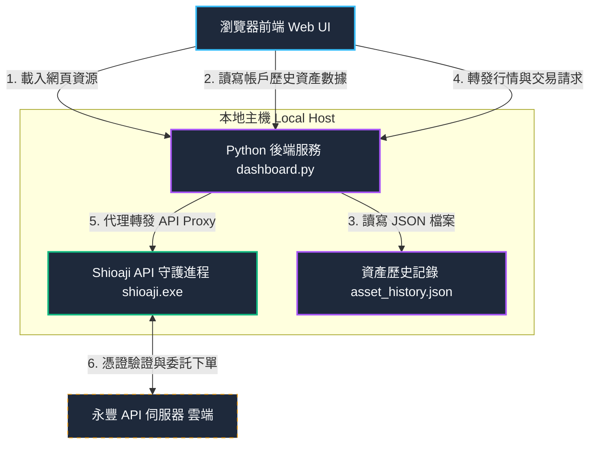

# StockGenie

本專案為專門為辦公室環境設計的**「低調、防窺、高質感」**永豐證券股票交易與資產監控儀表板。外觀精緻偽裝成系統效能監控工具，並擁有安全鎖與自訂確認彈窗雙重保障，防止任何下單交易誤會。

---

## 🔌 技術基礎與永豐 API 整合
本專案的行情與交易下單核心完全基於永豐金證券推出的開源 Python 交易套件 **[Shioaji](https://github.com/Sinotrade/Shioaji)**。
本系統透過本地端執行 `shioaji.exe` 的 daemon 守護進程，並由 `dashboard.py` 提供一個極簡且高安全性的 Web Proxy 代理通道，串接網頁前端與 Shioaji SDK 的實體運作。

---

## 🏗️ 系統架構圖 (System Architecture)
本系統採用「瀏覽器前端 (Web UI)」、「本地 Python 伺服器 (Web Proxy & Backend)」以及「Shioaji 守護進程 (Shioaji Daemon)」的三層式架構：

---

## 📂 文件導覽與快速跳轉連結

* 📖 **[專案操作與使用手冊 (walkthrough.md)](./walkthrough.md)**：
  * **內容**：包含詳細的環境配置（`.env`）、啟動步驟、防窺配色切換、歷史數據手動補錄以及安全下單機制的詳細操作指引。
* 📐 **[設計規格書 (dashboard_design.md)](./dashboard_design.md)**：
  * **內容**：詳細記錄專案的防窺配色原則、佈局架構設計、CORS 反向代理同源通訊規避手段、多執行緒併發設計原則。
* 🔍 **[全面代碼評審報告 (code_review.md)](./code_review.md)**：
  * **內容**：由資深架構師對專案在多執行緒併發、子進程 lifecycle 生命週期管理（防止緩衝區死鎖）、前端 Robustness 數據防禦性編程等角度做出的深入 Code Review 報告與未來迭代優化建議。
* 📝 **[任務清單 (task.md)](./task.md)**：
  * **內容**：開發階段各項功能調試、中文化細修與漏洞修正的完整檢核進度表（全數通過）。

---

## 🗂️ 專案實體代碼結構

* 🚀 **[啟動儀表板.bat](./啟動儀表板.bat)**：雙擊即可一鍵啟動後端代理伺服器與 Shioaji API。
* 🐍 **[dashboard.py](./dashboard.py)**：Python 後端。提供靜態資源、`/proxy/` 反向代理與 `/api/asset-history` 歷史資產數據讀寫服務。
* 🖥️ **[web/index.html](./web/index.html)**：前端網頁結構，包含自訂確認 Modal。
* 🎨 **[web/style.css](./web/style.css)**：外觀樣式表（含 Slate / Stealth / Muted 配色變數）。
* ⚙️ **[web/app.js](./web/app.js)**：網頁交互邏輯與輪詢、Canvas 折線圖及自選 Sparkline 繪製邏輯。
* 📡 **[持倉監控.bat](./持倉監控.bat)** / **[monitor.py](./monitor.py)**：獨立的控制台彩色持倉輪詢監控工具。v1.3.0 起，登入後 session 等待改為主動輪詢就緒，取代固定 sleep(8)。

---

## ⚡ 快速啟動指引

1. **配置環境**：
   確保工作區根目錄下的 **[.env](./.env)** 檔案內配置了正確的永豐 API 密鑰、憑證路徑及密碼。
2. **雙擊啟動**：
   雙擊執行 **[啟動儀表板.bat](./啟動儀表板.bat)**。系統偵測到 Shioaji API 伺服器就緒後，會自動在您的預設瀏覽器中開啟 `http://127.0.0.1:8081`（通常在 10 秒內，最多等待 30 秒）。
3. **優雅停止**：
   在 CMD 控制台視窗中按下 `Ctrl + C`，系統將會優雅安全地中止背景運行的 `shioaji.exe` 伺服器並釋放 Port `8080` 與 `8081`。

---

## ⚠️ 系統開發與版本更動守則

為了落實專案的追蹤與管理，本專案特別制定以下規範：
* **版本號同步更新限制**：未來在進行任何系統功能升級、修補 bug 或修改程式碼時，**版本號必須同步跟著更新**（目前版本為 `v1.3.25`）。請在修改完成後，主動更新：
  1. [index.html](./web/index.html) 的頁尾 Footer 版本標籤。
  2. 本 [README.md](./README.md) 的版本表記與指引說明。

---

## 📋 版本更新紀錄

### 📅 2026-06-10 (v1.3.18 至 v1.3.25)

* **v1.3.25** - **快取停用防禦與對比度深度修正**：
  * **徹底停用靜態快取**：為解決瀏覽器快取舊網頁與樣式導致的排版異常，後端 Python 伺服器 `DashboardHandler` 新增了 Cache-Control 防快取標頭，確保每次重新整理網頁時皆能 100% 載入最新檔案。
  * **黑白按鈕與 Tab 懸停對比度修正**：修正了「隱形黑白模式」下，白底按鈕與 active/hovered 狀態下的分時/均線切換 Tab 文字顏色為 `var(--bg-primary)`（極簡黑色），避免白底白字重疊消失。
  * **「顯示走勢圖」更名**：將自選監控標題旁的開關文字修改為更切合使用者語意的「顯示趨勢圖」，並加上浮動提示框說明其省流量效能。
  * **移除行內樣式衝突**：移成了訂單確認送出按鈕 `#btn-confirm-submit` 的冗餘行內樣式，防止干擾 CSS 主題覆寫。
  * **專案全面更名**：將專案名稱全面由 "SinoPac Genie" 改為 "StockGenie"。

* **v1.3.24** - **微型趨勢圖開關與按鈕對比度修正**：
  * **「顯示走勢圖」開關與效能優化**：自選清單標題旁新增「顯示走勢圖」Toggle 開關（預設為關閉，狀態持久化於 `localStorage`）。關閉時，卡片不渲染 Canvas 畫布，也免除微型折線繪製，以節省瀏覽器渲染負載、網路流量與 CPU 負荷。
  * **隱形黑白按鈕對比度修正**：修正了 stealth 配色下部分以 `--color-accent` 為背景的按鈕字體偏白導致文字看不見的問題，強制指定文字顏色為 `var(--bg-primary)`。

* **v1.3.23** - **隱形黑白模式配色對比度修正**：
  * **指數徽章背景對比修正**：修正「隱形黑白模式」下加權大盤指數卡片底色與漲跌幅徽章背景色重疊融合成一片的問題，將指數徽章背景強制指定為相對深色的 `--bg-secondary`，以提升易讀性與視覺層次。

* **v1.3.22** - **自選指數商品卡片結構對稱優化**：
  * **下單按鈕佔位對齊**：在無下單按鈕的大盤指數卡片最右側引入 `watchlist-order-btn-placeholder` 佔位元素（寬度為 `42px`），解決了其價格區塊偏向最右側、與普通股票垂直線無法對齊的問題。

* **v1.3.21** - **自選股響應式排版對齊優化**：
  * **微型走勢圖置中排版**：限制股票名稱寬度，並將走勢圖（Sparkline）設為 `flex: 1`（最大寬度為 `160px`）搭配 `margin-left: auto` 彈性推開價格區塊，解決寬螢幕下走勢圖擠在最右邊及中間大片空白的缺點。
  * **視窗縮放即時重繪**：新增視窗 resize 事件防禦性監聽器，視窗大小改變時自動在 150ms 後 debounce 重新繪製微型走勢圖，避免拉伸變形。

* **v1.3.20** - **自選排序與大盤顯示優化**：
  * **自選清單自訂排序**：自選股卡片最左側新增微型的上移（▲）與下移（▼）箭頭按鈕，排序結果可即時在清單中上下互換項目順序，並持久化至 `localStorage`。
  * **大盤卡片專屬配色**：針對指數商品（`IND`），自動為卡片套用淡灰底色樣式（使用 `--bg-tertiary`）。
  * **即時漲跌點數顯示**：大盤加權指數的漲跌幅徽章改為同時顯示「目前漲跌點數 (漲跌百分比)」（例如 `+150.25 (+0.82%)`），並將區塊寬度擴展至 `140px` 以防止折行跑版。

* **v1.3.19** - **大盤指數監控支援**：
  * **動態 Security Type 適配**：支援大盤加權指數 `TSE001` (或代碼 `001`) 監控，自動以 `IND` (指數) 商品類別查詢。
  * **自選清單交易限制**：當監控商品為指數 (`IND`) 時，自動隱藏「下單」按鈕。
  * **全方位圖表支援**：大盤加權指數的分時圖、日 K 線圖與 MA 均線指標均能完整載入與流暢繪製。

* **v1.3.18** - **介面響應式排版優化**：
  * **響應式天區收縮**：當瀏覽器視窗縮小時，自動隱藏系統標題（StockGenie）與連線狀態文字（僅留下運作燈號與倒數時鐘），釋放大量水平空間。
  * **防止文字折行**：為標題、連線狀態及倒數計時增加 `white-space: nowrap`，防止小寬度下產生的文字折行。

---

### 📅 2026-06-09 (v1.3.16 與 v1.3.17)

* **v1.3.17** - **安全性增強**：
  * **唯讀金鑰安全檢核與攔截**：按下下單按鈕時自動檢核是否有下單權限，若無權限，在前端顯示「下單權限關閉」。
  * **雙重安全檢核機制**：
    * 前端：開單時檢查 `state.tradingPermitted`，若無權限則跳出提示並阻斷下單抽屜開啟。
    * 後端：在 API 代理層（`/proxy/api/v1/order/place_order`）攔截下單請求。若金鑰屬唯讀金鑰，主動拒絕交易並回傳 400 錯誤。
    * 支援在 `.env` 中使用 `TRADING_ENABLED=false` 顯式停用交易功能。

* **v1.3.16** - **Bug 修正與效能優化**：
  * **修正 `drawCanvasLoading` 函數宣告遺失** 導致 JS 完全無法執行的語法錯誤。
  * **修正 `renderDetailTickChart` 未清除畫布** 導致「載入中...」文字與折線圖疊加殘留的問題。
  * **補抓自選股「昨日參考價」**：自選股昨日參考價改由 `/data/contracts/{code}` 補抓並快取。
  * **修正自選監控清單排版歪斜**：為 `watchlist-info` 加上 `flex:1`，使各列 sparkline 和價格欄位垂直對齊。
  * **快取機制優化**：新增 `fetchKbarsWithCache` 共享 2 年 kbars 快取（1 小時有效），大幅減少股票切換時的歷史日線讀取請求。
  * **降低輪詢頻率**：`checkServerStatus` 輪詢間隔延長至 60 秒。
  * **避開無效請求**：新增 `isTradingHours()`，盤後時段自動跳過 `trading_limits` 的 API 呼叫（盤後永豐會回傳 500 錯誤）。
  * **降頻控制**：新增 `_fetchCount` 計數器，帳號資金與歷史餘額等非高頻數據降為每 60 秒輪詢一次。

---

### 📅 2026-06-09 之前 (v1.3.x 以前)
詳見 `app.js` 檔頭版本歷史與 `task.md` 任務清單。
