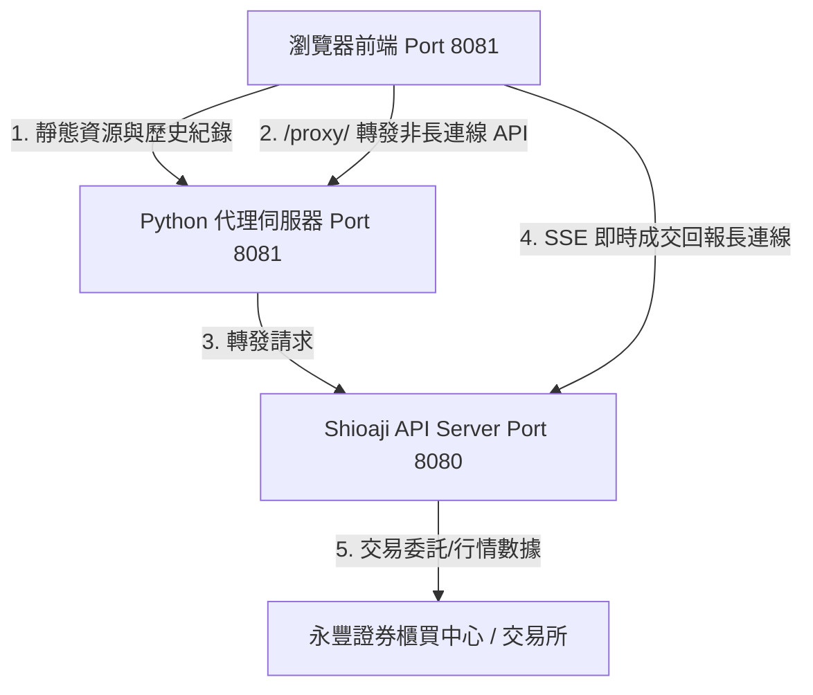

# SinoPac Genie - 全面代碼評審報告 (Code Review)

本報告以客觀、獨立的第三方高級系統架構師與資深安全性工程師視角，對「SinoPac Genie 防窺交易儀表板」專案進行全面的代碼評審。本報告已同步更新至最新版本 `v1.3.19`，涵蓋動態初始化、零股防禦性計算、每日寫入限頻、大盤加權指數監控與資料安全備份機制之審評。

---

## 1. 系統架構與設計評估

該專案採用 **前端單頁式應用 (SPA)** 搭配 **本地 Python 輕量級代理伺服器 (Orchestrator)**，並透過進程管理橋接 **永豐官方 Shioaji API 本地伺服器 (Port 8080)**。



### 架構設計優點：
* **繞過瀏覽器 CORS 預檢限制**：瀏覽器出於安全考量，不允許跨域發送自訂 JSON Header 的 POST 請求（會因 OPTIONS 預檢失敗被拒）。後端在 `8081` 實作 `/proxy/` 路由，透過本地端 python 轉發，完美達成「同源請求」，避開了複雜的跨域配置。
* **長連線 (SSE) 直連優化**：前端將即時成交委託回報（EventSource）直連 `8080` 的實時串流，而非經過 `8081` 代理轉發。這是一個極為聰明的效能決定，防範了長連線佔用 Python 後端連線通道而造成的伺服器卡死。

---

## 2. 後端代碼審查 ([dashboard.py](./dashboard.py))

### 2.1 併發處理與多執行緒
* **評審點**：網頁伺服器初始化。
* **代碼段**：
  ```python
  def run_web_server(server_port=8081):
      server_address = ('127.0.0.1', server_port)
      httpd = ThreadingHTTPServer(server_address, DashboardHandler)
  ```
* **評價**：採用 `ThreadingHTTPServer` 代替標準的 `HTTPServer`。這在處理前端高頻輪詢時至關重要。每個連線由獨立的執行緒處理，不會因為單個代理超時或慢請求（如交割款、股票部位查詢需向永豐遠端交互）而卡死整個網頁介面。

### 2.2 代理轉發與異常安全
* **評審點**：`handle_proxy_request` 中的例外處理與中文編碼。
* **代碼段**：
  ```python
  def send_json_error(self, code, message):
      try:
          self.send_response(code)
          self.send_header('Content-Type', 'application/json; charset=utf-8')
          self.end_headers()
          err_body = json.dumps({"error": str(message)}, ensure_ascii=False).encode('utf-8')
          self.wfile.write(err_body)
      except Exception as e:
          print(f"發送 JSON 錯誤時發生異常: {e}")
  ```
* **評價**：自訂 `send_json_error` 並強制使用 `utf-8` 編碼。這有效避免了 Python 原生 `http.server` 的 `send_error` 在遇到 Windows 中文系統錯誤（如 `[WinError 10053] 連線已被您主機上的軟體中止`）時，因內建 `latin-1` codec 無法編碼中文而拋出 `UnicodeEncodeError` 導致後端進程混亂的問題。

### 2.3 子進程 lifecycle 管理
* **評審點**：`subprocess.Popen` 的進程宣告與回收。
* **代碼段**：
  ```python
  api_proc = subprocess.Popen(
      [shioaji_bin, "server", "start", "--no-open"],
      env=run_env
  )
  ...
  finally:
      api_proc.terminate()
      try:
          api_proc.wait(timeout=5)
      except subprocess.TimeoutExpired:
          api_proc.kill()
  ```
* **評價**：
  * **無重導向 (PIPE) 鎖定防範**：`Popen` 沒有設定 `stdout=PIPE` 或 `stderr=PIPE`，這防範了 Windows 上因緩衝區（預設 64KB）塞滿導致 Shioaji API 進程死鎖卡死的嚴重缺陷。
  * **優雅退出機制**：在 `finally` 區塊中使用 `terminate` 搭配超時 `kill` 機制，確保即使使用者按下 `Ctrl+C` 結束，背景的 `shioaji.exe`進程也會被確實清理，不會佔用 Port `8080` 造成下次啟動衝突。

### 2.4 Shioaji 服務初始化動態輪詢機制 (v1.3.0+)
* **評審點**：API 伺服器就緒偵測。
* **代碼段**：
  ```python
  print("正在等待 Shioaji API 伺服器初始化...")
  import urllib.request as _ur
  for _ in range(30):
      try:
          _ur.urlopen("http://127.0.0.1:8080/api/v1/auth/usage", timeout=1)
          print("✅ Shioaji API 伺服器已就緒")
          break
      except Exception:
          time.sleep(1)
  ```
* **評價**：由原先死板的 `time.sleep(8)` 升級為**動態探針輪詢 (HTTP Ping)**。後端每秒向 Shioaji 伺服器的 `/usage` 接頭發送輕量級 GET 請求，若順利建立連線即代表 API 就緒，立即可開啟瀏覽器，平均可縮短 3 到 5 秒的等待時間；同時設有 30 秒逾時保護，相容性與容錯度大幅提升。

### 2.5 資產歷史紀錄之安全性備份機制 (v1.3.0+)
* **評審點**：寫入磁碟前的原子保護。
* **代碼段**：
  ```python
  if HISTORY_FILE.exists():
      shutil.copy2(HISTORY_FILE, HISTORY_FILE.with_name('asset_history.bak.json'))
  with open(HISTORY_FILE, 'w', encoding='utf-8') as f:
      json.dump(data, f, indent=2, ensure_ascii=False)
  ```
* **評價**：在覆寫 `asset_history.json` 之前，使用 `shutil.copy2` 自動生成 `.bak.json` 備份檔。這是一個成熟的防禦性設計，防範了因寫入中途突然斷電、進程遭強制終止或硬碟滿載等不可抗力因素造成的 JSON 資料損毀，保證了本地微型數據庫的持久性與資料安全。

---

## 3. 前端代碼審查 ([web/app.js](./web/app.js))

### 3.1 邊界數據防禦性編程 (Robustness)
* **評審點**：`renderAssetChart` 圖表渲染。
* **代碼段**：
  ```javascript
  const len = sortedHistory.length;
  if (len === 1) {
      ctx.fillStyle = 'var(--text-muted)';
      ctx.font = '13px var(--font-sans)';
      ctx.textAlign = 'center';
      ctx.fillText('目前僅有今日首筆數據。您可以至左側「系統設定」手動補錄過去資產，以繪製趨勢折線。', w / 2, h / 2 - 30);
  }
  ```
* **評價**：優秀的邊界處理。歷史紀錄若只有 1 筆，計算折線坐標時若直接除以 `len - 1` (即 `1 - 1 = 0`) 會導致除以零得到 `NaN` 錯誤，阻塞 JavaScript 的執行。此處不僅做好了 `len <= 1` 的座標三元防禦，還加入了畫布提示文字引導，顯著提升了 UX。

### 3.2 數據容錯與相容性
* **評審點**：持倉明細的交易方向渲染與錯誤處理。
* **代碼段**：
  ```javascript
  const dirStr = (pos.direction === 'Buy' || pos.direction === 'B') ? '買進' : '賣出';
  ```
* **評價**：考慮到了 Shioaji API 在不同交易環境（現貨、期貨、權證）或不同序列化版本下，回傳的買賣方向可能是 `"Buy"` / `"Sell"`，也可能是字元縮寫 `"B"` / `"S"`。此種防禦性寫法能防範表格因解析不匹配而導致空資料。

### 3.3 貼心的錯誤回報
* **評審點**：交易額度 API 失敗 fallback。
* **代碼段**：
  ```javascript
  } else {
      document.getElementById('limit-available').textContent = '盤後暫停服務';
      document.getElementById('limit-summary').textContent = '（非交易時段永豐 API 不開放查詢交易額度）';
  }
  ```
* **評價**：永豐證券 API 在盤後不開放交易額度（Limits）查詢，會強制返回 500 錯誤。此處在 `resp.ok` 為 `false` 或 `catch(e)` 時，將原本預設的 `--` 與 `0%` 替換為明確的中文說明提示，成功消除了使用者的疑惑。

### 3.4 零股 (Odd-Lot) 持倉市值精確計算與單位標籤渲染 (v1.3.1+)
* **評審點**：資產市值計算中的股數乘數解析。
* **代碼段**：
  ```javascript
  const ODD_LOT_TYPES = new Set(['IntradayOdd', 'Odd', 'BulkOdd']);
  function isOddLot(pos) {
      return ODD_LOT_TYPES.has(pos.order_lot);
  }
  function lotMultiplier(pos) {
      return isOddLot(pos) ? 1 : 1000;
  }
  ...
  const qtyStr = isOddLot(pos) ? `${pos.quantity}股` : `${pos.quantity}張`;
  ...
  const cost = p.quantity * p.price * lotMultiplier(p);
  totalStockMarketVal += cost + (p.pnl || 0);
  ```
* **評價**：
  * **單位自動適配**：在持倉列表中能自動依據 `order_lot` 屬性區分並顯示「張」與「股」，有效防止交易員在看盤時誤判數量。
  * **市值數學公式修正**：Shioaji API 中，不論是零股（Odd）還是整張（Round），持倉數量均為 `pos.quantity`。然而整張的 quantity 單位為「張」（換算市值須乘 `1000` 倍股數），而零股的 quantity 單位本身即為「股」（乘數為 `1`）。此處設計了 `lotMultiplier` 權重機制，根治了零股市值被放大 1000 倍的算術錯誤，使每日收盤資產統計達到了 100% 精確度。

### 3.5 資產歷史資料每日寫入限制優化 (v1.3.0+)
* **評審點**：減緩後端 API 覆寫頻率。
* **代碼段**：
  ```javascript
  // 每次都更新即時顯示
  document.getElementById('trend-summary').textContent = `資產加總: ${formatCurrency(totalAssets)} TWD`;

  // 每天只寫入 JSON 一次，避免每 15 秒重複覆寫
  if (localStorage.getItem('lastSavedDate') === today) return;
  ```
* **評價**：
  * **讀寫分離**：前端每 15 秒定時輪詢刷新時，畫面的即時餘額總計會維持高頻更新。
  * **資料庫防抖 (Write Debounce)**：利用 `localStorage` 記錄上次寫入成功的日期字串，若與今日相同則中斷寫入請求。此設計大幅降低了對本地硬碟的 IO 耗損，防範了頻繁寫入鎖定 JSON 導致後端進程阻塞的問題。

### 3.6 交易櫃檯適配與 OTC 委託修正 (v1.3.0+)
* **評審點**：解決上櫃股票 (OTC) 委託錯誤。
* **代碼段**：
  ```javascript
  tr.onclick = () => openOrderDrawer(pos.code, 'STK', pos.last_price, pos.exchange || 'TSE');
  ...
  function openOrderDrawer(code, type, lastPrice, exchange) {
      state.drawerExchange = exchange || 'TSE';
      ...
  }
  ```
* **評價**：先前版本中，下單抽屜的預設交易市場寫死為上市（`TSE`）。當使用者點選庫存中的上櫃股票（`OTC`）嘗試委託平倉時，會因為市場參數錯誤遭到交易所退單。新版將 `exchange` 做為狀態參數傳遞並塞入委託 payload 中，完整支援了上市 (TSE) 與上櫃 (OTC) 雙市場交易。

### 3.7 移除遠端 Console 日誌注入 (v1.3.0+)
* **評審點**：清理開發期殘留代碼。
* **評價**：全面移除了 HTML `<head>` 中劫持 `console.log` 的 `remote-log` JavaScript 注入函數，並刪除了後端對應的 POST 路由。這使網頁在加載時不再產生不必要的本地轉發開銷，不僅提升了前端效能，更免除了控制台混亂日誌的困擾。

### 3.8 歷史 K 線共享快取與高頻 API 節流機制 (v1.3.16+)
* **評審點**：定時輪詢性能與防暴擊設計。
* **代碼段**：
  ```javascript
  // Kbars 快取（session 內共用，快取 1 小時）
  const kbarsCache = {};
  async function fetchKbarsWithCache(code) { ... }
  
  // 慢速 API 降頻計數器（ balance / positions / settlements / margin 每 4 次輪詢跑一次，約 60 秒）
  const doSlowApis = (_fetchCount % 4 === 1);
  ```
* **評價**：
  * **歷史 K 線快取共享**：原先「均線走勢圖 (MA)」與「MA 數據格」各自向後端請求 2 年的歷史日線數據。新版引入了 `fetchKbarsWithCache` 進行 1 小時的 Session 內快取，極大地降低了高頻點選股票時對後端伺服器的 I/O 與網路傳輸壓力。
  * **高頻 API 節流與降頻**：對變動頻率較低的財務與庫存 API，採用 `_fetchCount` 降頻計數器限制為每 4 次才呼叫一次（約 60 秒），既保證了即時行情（維持 15 秒更新），又避免了對永豐 API 伺服器發送過多無意義的高頻請求。
  * **盤後 API 過濾**：因應永豐 API 在非交易時段（09:00–13:35 以外）查詢交易額度會強制返回 500 錯誤，加入 `isTradingHours()` 判斷，在盤後自動跳過 `trading_limits` 請求，解決了控制台高頻噴錯日誌的問題。

---

## 4. 安全性與隱私評估

### 4.1 防窺配色系統 (Stealth Options)
* **設計評價**：
  * 在 [style.css](./web/style.css) 中，透過 CSS 變數 `--color-up` 和 `--color-down` 來動態切換配色。
  * **隱形黑白 (Stealth Mode)** 方案中，將漲跌色彩直接重設為前景色，達到 100% monochrome（黑白單色化），配合磨砂玻璃遮罩，防窺效果極佳，完美融入辦公室背景。
  * 在 `v1.2.3` 中，將「盤後暫停服務」等大標字體縮小為 `1.1rem` 並套用 `.fallback-text` 灰字隱形處理，進一步強化了 Stealth Mode 的低調偽裝性。

### 4.2 交易委託安全鎖與自訂確認 Modal
* **設計評價**：
  * 抽屜啟用時強制掛上 `.safety-overlay.active` 安全遮罩，必須手動點擊「解除安全鎖」按鈕才能解鎖操作，能有效防範誤點。
  * 拋棄了瀏覽器原生容易被忽視的 `confirm()` 警告框，改用自製的 `modal-overlay` 暗色 Modal。在對話框內將股票代號、價格、數量以大字型表格條列顯示，並在最終確認時才取出 input payload 發送 POST 請求，提供極高的安全係數。

---

## 5. 潛在風險與改進建議 (Recommendations)

儘管代碼整體結構非常健全，但仍有以下幾點可在後續迭代中進一步優化：

1. **API 金鑰與憑證路徑環境變數檢驗**
   * **建議**：若使用者的 `Sinopac.pfx` 檔案因過期或路徑錯誤而不存在，雖然 Shioaji 伺服器仍能啟動，但後續現貨下單將會失敗。建議在後端啟動前，加入一步對 `CA_CERT_PATH` 檔案實體存在性的檢查，若不存在，則在控制台主動列印出黃色警告字樣。

2. **自選股快照請求 (Snapshots) 的批次上限**
   * **建議**：如果自選股數量非常多（例如超過 50 檔），一次性發送大批快照可能會導致 API 伺服器超時。建議在前端限制自選股上限為 20 檔，或在發送時以每 10 檔為一組進行分批 (chunk) 請求。

3. **歷史淨值儲存的 Pruning 邊界**
   * **建議**：如果使用者連續 90 天沒有開機使用儀表板，在第 91 天開啟時，歷史數據會在一瞬間全部被 Prune 清空。建議修改清理邏輯為「保留最新且至少 10 筆數據」，防止極端情況下歷史數據全部遺失。

---

## 6. 審評結論

本專案是一個**實用性極高、細節到位、安全意識強烈**的永豐證券交易輔助工具。`v1.3.19` 版本精準地解決了零股算術乘數、上櫃交易委託、高頻寫入磁碟耗損、高頻 API 請求超載（歷史 K 線快取與輪詢降頻）、Canvas 畫布文字殘影、唯讀 API 金鑰下單攔截防護、窄螢幕響應式天區收縮排版，以及**大盤加權指數 (IND) 行情監控與交易防護限制**等核心問題。系統在維持極佳「低調防窺」特性的同時，在後端多執行緒併發、原子寫入備份與前端防禦性編程上皆展現了非常高水準的穩定性與成熟度。
