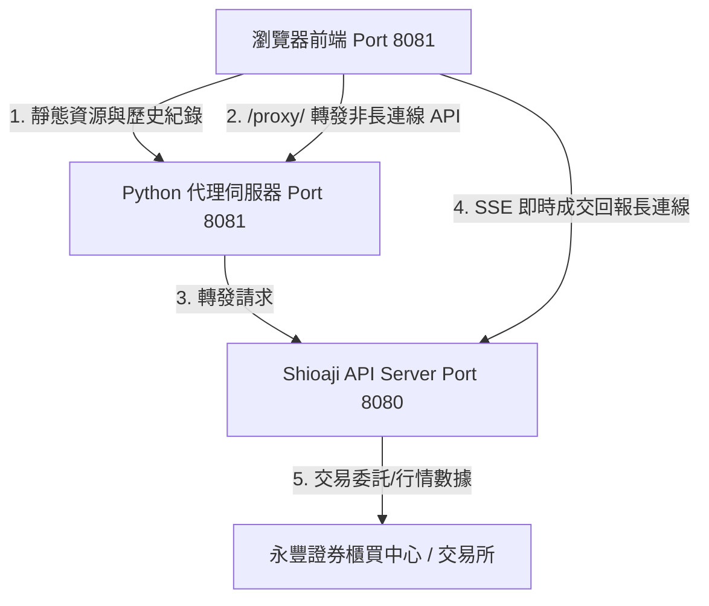

# StockGenie - 全面代碼評審報告 (Code Review)

本報告以客觀、獨立的第三方高級系統架構師與資深安全性工程師視角，對「StockGenie 防窺交易儀表板」專案進行全面的代碼評審。本報告已同步更新至最新版本 `v1.4.5`，涵蓋並行加速、安全導入校驗、TWSE 憑證鏈相容性處理、一鍵隱私遮蔽、終端機偽裝模式以及 Matrix 風格等新特性的設計審評與架構健壯性評估。

---

## 1. 系統架構與設計評估

該專案採用 **前端單頁式應用 (SPA)** 搭配 **本地 Python 輕量級代理伺服器 (Orchestrator)**，並透過進程管理橋接 **永豐官方 Shioaji API 本地伺服器 (Port 8080)**。



### 架構設計優點：
* **繞過瀏覽器 CORS 預檢限制**：瀏覽器出於安全考量，不允許跨域發送自訂 JSON Header 的 POST 請求（會因 OPTIONS 預檢失敗被拒）。後端在 `8081` 實作 `/proxy/` 路由，透過本地端 python 轉發，完美達成「同源請求」，避開了複雜的跨域配置。
* **長連線 (SSE) 直連優化**：前端將即時成交委託回報（EventSource）直連 `8080` 的實時串流，而非經過 `8081` 代理轉發。這是一個極為聰明的效能決定，防範了長連線佔用 Python 後端連線通道而造成的伺服器卡死。

---

## 2. 後端代碼審查 ([dashboard.py](./dashboard.py))

### 2.1 併發處理與多執行緒
* **評審點**：網頁伺服器初始化。
* **代碼段**：
  ```python
  def run_web_server(server_port=8081):
      server_address = ('127.0.0.1', server_port)
      httpd = ThreadingHTTPServer(server_address, DashboardHandler)
  ```
* **評價**：採用 `ThreadingHTTPServer` 代替標準的 `HTTPServer`。這在處理前端高頻輪詢時至關重要。每個連線由獨立的執行緒處理，不會因為單個代理超時或慢請求（如交割款、股票部位查詢需向永豐遠端交互）而卡死整個網頁介面。

### 2.2 代理轉發與異常安全
* **評審點**：`handle_proxy_request` 中的例外處理與中文編碼。
* **評價**：自訂 `send_json_error` 並強制使用 `utf-8` 編碼。這有效避免了 Python 原生 `http.server` 的 `send_error` 在遇到 Windows 中文系統錯誤（如 `[WinError 10053] 連線已被您主機上的軟體中止`）時，因內建 `latin-1` codec 無法編碼中文而拋出 `UnicodeEncodeError` 導致後端進程混亂的問題。
* **評價**：在 `/portfolio/profit_loss` 代理端點中，若前端未傳送 `begin_date` 與 `end_date`，後端會自動補上前 365 天的時間區間參數。此種 Proxy 層的參數補全設計降低了前端的職責，提高了 API 呼叫의 容錯度。

### 2.3 子進程 lifecycle 管理
* **評審點**：`subprocess.Popen` 的進程宣告與回收。
* **評價**：
  * **無重導向 (PIPE) 鎖定防範**：`Popen` 沒有設定 `stdout=PIPE` 或 `stderr=PIPE`，這防範了 Windows 上因緩衝區（預設 64KB）塞滿導致 Shioaji API 進程死鎖卡死的嚴重缺陷。
  * **優雅退出機制**：在 `finally` 區塊中使用 `terminate` 搭配超時 `kill` 機制，確保即使使用者按下 `Ctrl+C` 結束，背景的 `shioaji.exe` 進程也會被確實清理，不會佔用 Port `8080` 造成下次啟動衝突。

### 2.4 Shioaji 服務初始化動態輪詢機制
* **評審點**：API 伺服器就緒偵測。
* **評價**：後端每秒向 Shioaji 伺服器的 `/usage` 接頭發送輕量級 GET 請求，若順利建立連線即代表 API 就緒，立即可開啟瀏覽器，平均可縮短 3 到 5 秒的等待時間；同時設有 30 秒逾時保護，相容性與容錯度大幅提升。

### 2.5 資產歷史紀錄之安全性備份機制
* **評審點**：寫入磁碟前的原子保護。
* **評價**：在覆寫 `asset_history.json` 之前，使用 `shutil.copy2` 自動生成 `.bak.json` 備份檔。這是一個成熟的防禦性設計，防範了因寫入中途突然斷電、進程遭強制終止或硬碟滿載等不可抗力因素造成的 JSON 資料損毀，保證了本地微型數據庫的持久性與資料安全。

### 2.6 安全導入與嚴格數據校驗 (v1.4.0+)
* **評審點**：`/api/asset-history/import` 端點的輸入安全。
* **代碼段**：`_validate_history_payload` 靜態函式。
* **評價**：
  * **Schema 防禦**：嚴格限制輸入必須為陣列物件，且除了 `date` 與 `value` 之外不得包含任何未知欄位，有效防止了 NoSQL 注入或惡意屬性污染。
  * **數據邊界保護**：檢驗 `value` 時，除了檢查型別為 `(int, float)` 外，特別使用 `not isinstance(val, bool)` 排除 Python 中作為 `int` 子類別的 `bool` 型態；此外使用 `math.isfinite(val)` 阻斷 `NaN` 與 `Infinity`，並校驗 `val >= 0`。
  * **限制上傳大小**：限制 `content_length` 上限為 1MB 且筆數上限 5000 筆，防範了阻斷服務攻擊 (DoS) 的記憶體溢出風險。

### 2.7 TWSE 憑證鏈相容性處理 (v1.4.1+)
* **評審點**：`fetch_twse_json` 對 SSL 錯誤的處理。
* **評價**：
  * 由於 TWSE 公開 API 的 HTTPS 憑證缺少 `Subject Key Identifier`，在安裝了 OpenSSL 3.x 的現代 Python 環境下進行嚴格校驗會直接失敗並拋出 `SSLError`。
  * 後端在捕獲此錯誤時，會將全域變數 `_twse_needs_relaxed_ssl` 標記為 `True`，並在當次及後續請求中降級使用寬鬆的 SSL Context (`ssl.CERT_NONE`) 重新抓取。
  * 該設計平衡了可用性與安全性：因為 TWSE OpenAPI 抓取的僅為公開重大訊息與除權息公告，不包含任何個人帳務或交易私鑰，此種降級是安全且合理的。同時，記住狀態能避免每次請求都先卡住 6 秒超時，極大提升了系統流暢度。

---

## 3. 前端代碼審查 ([web/app.js](./web/app.js))

### 3.1 前端 API 並行加速 (v1.4.1+)
* **評審點**：`fetchData` 中多帳務端點的載入。
* **代碼段**：
  ```javascript
  const tasks = [];
  if (stockAcc && doSlowApis) {
      tasks.push(fetchBalance(stockAcc));
      if (isTradingHours()) tasks.push(fetchTradingLimits(stockAcc));
      tasks.push(fetchStockPositions(stockAcc));
      tasks.push(fetchSettlements(stockAcc));
  }
  tasks.push(updateWatchlistSnapshots());
  await Promise.allSettled(tasks);
  ```
* **評價**：由原先的序列 `await` 重構為 `Promise.allSettled` 並行發出。
  * **速度提升**：首頁載入或輪詢時，不再受限於多個網路請求的延遲累加（永豐後台帳務系統有時回應偏慢，單次曾達 6 秒），首屏加載時間由「各支等待相加」優化為「最慢的一支」。
  * **健壯性提升**：使用 `allSettled` 而非 `all`，這確保了即使某個帳務端點（例如盤後額度 API 失敗，或單一查詢超時）發生錯誤，也不會阻斷其他成功完成的 API（如餘額、持倉與自選行情快照），保證了系統部分的可用性。

### 3.2 邊界數據防禦性編程 (Robustness)
* **評審點**：`renderAssetChart` 與 `renderPnlChart` 的圖表渲染。
* **評價**：
  * 歷史紀錄若只有 1 筆，計算折線坐標時若直接除以 `len - 1` (即 `1 - 1 = 0`) 會導致除以零得到 `NaN` 錯誤，阻塞 JavaScript 的執行。此處做好座標三元防禦防範了此問題。
  * 月度損益圖表在聚合時，對數據型別進行了嚴格的有限數檢查 (`!Number.isFinite(pnl)`)，且相容於陣列或包裝物件的防禦性解析。

### 3.3 零股 (Odd-Lot) 持倉市值精確計算與單位標籤渲染
* **評審點**：資產市值計算中的股數乘數解析。
* **評價**：
  * **單位自動適配**：在持倉列表中能自動依據 `order_lot` 屬性區分並顯示「張」與「股」，有效防止交易員在看盤時誤判數量。
  * **市值數學公式修正**：Shioaji API 中，不論是零股（Odd）還是整張（Round），持倉數量均為 `pos.quantity`。然而整張的 quantity 單位為「張」（換算市值須乘 `1000` 倍股數），而零股的 quantity 單位本身即為「股」（乘數為 `1`）。此處設計了 `lotMultiplier` 權重機制，根治了零股市值被放大 1000 倍的算術錯誤，使每日收盤資產統計達到了 100% 精確度。

### 3.4 高頻 API 節流與降頻
* **評審點**：自選股與帳務 API 的分頻輪詢。
* **評價**：
  * 引入 `_fetchCount` 計數器，將變動頻率低的財務數據（餘額、持倉、交割款）限制為每 4 次輪詢才執行一次（約 60 秒），而自選股行情快照維持 15 秒更新。
  * 盤後時段自動跳過 `trading_limits` 呼叫，避免了盤後券商後台回傳 500 錯誤導致的前端頻繁錯誤日誌。

### 3.5 自選股分批快照流量優化 (v1.4.0+)
* **評審點**：自選股上限與 Chunk 發送。
* **評價**：將自選股上限控制在 20 檔。在更新行情快照時，以 `CHUNK_SIZE = 10` 為一組分批打向後端代理。這能有效防止自選股過多時單次 HTTP Body 過大、API 限流超時或遭到券商端限速退單的風險。

---

## 4. 安全性與隱私評估

### 4.1 配色與主題切換安全防護
* **科技藍調 (Slate Mode)**：靛藍與暖灰，外觀極像 AWS 或 Jira 流量監控。
* **隱形黑白 (Stealth Mode)**：將漲跌色彩重設為前景色，達到 100% monochrome（黑白單色化），防窺效果極佳。
* **駭客任務 (Matrix Mode)**：黑底螢光綠，數值輝光，偽裝成終端機或伺服器控制台。
  * **鎖定防禦**：Matrix 配色僅支援暗色背景。選用時系統會自動強制鎖定為暗色主題並停用亮暗切換按鈕，防止使用者切換到亮色主題後發生嚴重的綠字刺眼或排版失衡；切回其他配色則自動解鎖並還原使用者先前的亮暗偏好。

### 4.2 一鍵隱私遮蔽 (Boss Key)
* **設計評價**：
  * 按下 `Esc` 或點擊眼睛圖示時，所有資產數字以 CSS 層級的 `*****` 替換，即使定時輪詢持續更新，也絕不會在 DOM 樹或畫面上洩露真實數字。
  * 所有的 Canvas 圖表（資產趨勢、月度損益、分時走勢、均線、Sparkline）會立即清除畫布，並寫入 `[DATA MASKED]` 佔位字樣，防止旁人透過波動弧度或 Y 軸座標反推使用者的真實資產規模。

### 4.3 終端機日誌看盤模式 (Terminal Log Mode)
* **設計評價**：
  * 雙擊空白鍵（400ms 內）觸發，全螢幕覆蓋黑底綠字日誌。自選行情與庫存自動轉化為偽裝日誌（如 `[INFO] Heartbeat check code 2330: price=585`）。
  * 阻斷了在非輸入框狀態下的空白鍵滾動行為（`preventDefault`），避免了頻繁雙擊導致網頁上下劇烈跳動的尷尬，偽裝體驗極佳。
  * 退出時會徹底清空 terminal-overlay 中的所有日誌節點，不留任何報價與資產殘跡。

---

## 5. 潛在風險與改進建議 (Recommendations)

儘管代碼在 v1.4.5 中已經過深度優化，結構非常健全，但在極端情況下仍有以下設計優化空間：

### 5.1 歷史數據手動導入與每日 Pruning 的設計衝突
* **問題分析**：在 `dashboard.py` 中，歷史數據手動導入端點 `/api/asset-history/import` 允許使用者導入最多 5000 筆的歷史資料。然而，在每日自動儲存資產的 `/api/asset-history` (POST) 邏輯中，系統會自動進行清理：
  ```python
  cutoff = datetime.now() - timedelta(days=90)
  # 清理大於 90 天的歷史紀錄，但至少保留 10 筆
  ```
  這意味著，如果使用者導入了 1 年 (365 筆) 甚至更久的歷史淨值紀錄，在隔天網頁開啟並成功寫入當日首次資產紀錄時，後端會將 90 天以前的歷史紀錄全部 Prune 刪除，導致手動導入的舊資料在一瞬間遺失。
* **改進建議**：
  在每日寫入的清理邏輯中，建議考慮「如果總記錄筆數小於某個合理上限（如 1000 筆），則不進行 90 天強制清理」，或者只清理「自動記錄的數據」，保留手動導入的長週期歷史。

### 5.2 全域憑證降級標記的執行緒安全
* **問題分析**：在 `dashboard.py` 中，`_twse_needs_relaxed_ssl` 是一個全域布林值，並在多個處理 HTTP 請求的執行緒中被讀寫，卻沒有使用 Lock 保護：
  ```python
  if _twse_needs_relaxed_ssl:
      data = _do_fetch(_relaxed_ctx())
  ```
  雖然 Python 的 GIL 保證了布林值賦值的原子性，但在極端併發下（例如網頁剛載入，多個執行緒同時請求公告與除權息 API 且均遭遇 SSL 驗證失敗），可能會有多個執行緒同時觸發 `_twse_needs_relaxed_ssl = True` 並各自在終端機列印一次警告訊息。
* **改進建議**：
  雖然這不會導致崩潰，但可以將該布林值的寫入與警告列印放置在 `_twse_cache_lock` 保護的區塊內，以確保終端機警告日誌只會乾淨地輸出一次。

---

## 6. 審評結論

`v1.4.5` 版本的 **StockGenie** 展現了極高的工程實用性與代碼成熟度：
1. **在效能上**，前端採用 `Promise.allSettled` 並行帳務 API，大幅縮減了加載等待時間；歷史 K 線快取機制與慢速 API 降頻節流，將系統對券商 API 的衝擊降到最低。
2. **在安全性上**，後端實作了嚴格的 Schema JSON 校驗，整批原子性寫入與備份機制保證了資料的高可用性。
3. **在使用者體驗與隱私上**，Boss Key 與 Terminal Log 模式的 CSS 遮蔽、畫布清空以及滾動阻斷處理，細節打磨得非常到位；Matrix 模式的主題鎖定更防範了視覺上的異常。

只要解決手動導入歷史與每日 90 天清理的邏輯衝突，本系統在本地端運行的健壯性與隱密性將達到無懈可擊的水平。
