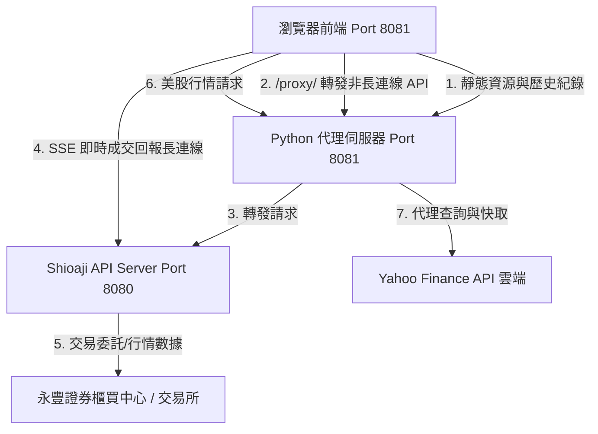

# StockGenie - 全面代碼評審報告 (Code Review)

本報告以客觀、獨立的第三方高級系統架構師與資深安全性工程師視角，對「StockGenie 防窺交易儀表板」專案進行全面的代碼評審。本報告已同步更新至最新版本 `v1.5.1`，涵蓋並行加速、安全導入校驗、TWSE 憑證鏈相容性處理、一鍵隱私遮蔽、終端機偽裝模式、美股自選監控代理，以及跨分頁行情降頻等新特性的設計審評與架構健壯性評估。

---

## 1. 系統架構與設計評估

該專案採用 **前端單頁式應用 (SPA)** 搭配 **本地 Python 輕量級代理伺服器 (Orchestrator)**，並透過進程管理橋接 **永豐官方 Shioaji API 本地伺服器 (Port 8080)** 與 **Yahoo Finance 美股公開 API**。



### 架構設計優點：
* **繞過瀏覽器 CORS 預檢限制**：瀏覽器出於安全考量，不允許跨域發送自訂 JSON Header 的 POST 請求（會因 OPTIONS 預檢失敗被拒）。後端在 `8081` 實作 `/proxy/` 路由，透過本地端 python 轉發，完美達成「同源請求」，避開了複雜的跨域配置。
* **長連線 (SSE) 直連優化**：前端將即時成交委託回報（EventSource）直連 `8080` 的實時串流，而非經過 `8081` 代理轉發。這是一個極為聰明的效能決定，防範了長連線佔用 Python 後端連線通道而造成的伺服器卡死。
* **雙市場行情隔離轉發**：台股行情透過本地 Shioaji 伺服器代理，美股行情則由 Python 後端 `/api/us-chart` 代理 Yahoo Finance API，不需使用者提供任何美股 API 金鑰，實現了開箱即用的跨國自選監控。

---

## 2. 後端代碼審查 ([dashboard.py](./dashboard.py))

### 2.1 併發處理與多執行緒
* **評審點**：網頁伺服器初始化。
* **代碼段**：
  ```python
  def run_web_server(server_port=8081):
      server_address = ('127.0.0.1', server_port)
      httpd = ThreadingHTTPServer(server_address, DashboardHandler)
  ```
* **評價**：採用 `ThreadingHTTPServer` 代替標準的 `HTTPServer`。這在處理前端高頻輪詢時至關重要。每個連線由獨立的執行緒處理，不會因為單個代理超時或慢請求（如交割款、股票部位查詢需向永豐遠端交互）而卡死整個網頁介面。

### 2.2 代理轉發與異常安全
* **評審點**：`handle_proxy_request` 中的例外處理與中文編碼。
* **評價**：自訂 `send_json_error` 並強制使用 `utf-8` 編碼。這有效避免了 Python 原生 `http.server` 的 `send_error` 在遇到 Windows 中文系統錯誤（如 `[WinError 10053] 連線已被您主機上的軟體中止`）時，因內建 `latin-1` codec 無法編碼中文而拋出 `UnicodeEncodeError` 導致後端進程混亂的問題。
* **評價**：在 `/portfolio/profit_loss` 代理端點中，若前端未傳送 `begin_date` 與 `end_date`，後端會自動補上前 365 天的時間區間參數。此種 Proxy 層的參數補全設計降低了前端的職責，提高了 API 呼叫的容錯度。

### 2.3 子進程 lifecycle 管理
* **評審點**：`subprocess.Popen` 的進程宣告與回收。
* **評價**：
  * **無重導向 (PIPE) 鎖定防範**：`Popen` 沒有設定 `stdout=PIPE` 或 `stderr=PIPE`，這防範了 Windows 上因緩衝區（預設 64KB）塞滿導致 Shioaji API 進程死鎖卡死的嚴重缺陷。
  * **優雅退出機制**：在 `finally` 區塊中使用 `terminate` 搭配超時 `kill` 機制，確保即使使用者按下 `Ctrl+C` 結束，背景的 `shioaji.exe` 進程也會被確實清理，不會佔用 Port `8080` 造成下次啟動衝突。

### 2.4 Shioaji 服務初始化動態輪詢機制
* **評審點**：API 伺服器就緒偵測。
* **評價**：後端每秒向 Shioaji 伺服器的 `/usage` 接口發送輕量級 GET 請求，若順利建立連線即代表 API 就緒，立即可開啟瀏覽器，平均可縮短 3 到 5 秒的等待時間；同時設有 30 秒逾時保護，相容性與容錯度大幅提升。

### 2.5 資產歷史紀錄之安全性備份機制
* **評審點**：寫入磁碟前的原子保護。
* **評價**：在覆寫 `asset_history.json` 之前，使用 `shutil.copy2` 自動生成 `.bak.json` 備份檔。這是一個成熟的防禦性設計，防範了因寫入中途突然斷電、進程遭強制終止或硬碟滿載等不可抗力因素造成的 JSON 資料損毀，保證了本地微型數據庫的持久性與資料安全。

### 2.6 安全導入與嚴格數據校驗 (v1.4.0+)
* **評審點**：`/api/asset-history/import` 端點的輸入安全。
* **代碼段**：`_validate_history_payload` 靜態函式。
* **評價**：
  * **Schema 防禦**：嚴格限制輸入必須為陣列物件，且除了 `date` 與 `value` 之外不得包含任何未知欄位，有效防止了 NoSQL 注入或惡意屬性污染。
  * **數據邊界保護**：檢驗 `value` 時，除了檢查型別為 `(int, float)` 外，特別使用 `not isinstance(val, bool)` 排除 Python 中作為 `int` 子類別 of `bool` 型態；此外使用 `math.isfinite(val)` 阻斷 `NaN` 與 `Infinity`，並校驗 `val >= 0`。
  * **限制上傳大小**：限制 `content_length` 上限為 1MB 且筆數上限 5000 筆，防範了阻斷服務攻擊 (DoS) 的記憶體溢出風險。

### 2.7 TWSE 憑證鏈相容性處理 (v1.4.1+)
* **評審點**：`fetch_twse_json` 對 SSL 錯誤的處理。
* **評價**：
  * 由於 TWSE 公開 API 的 HTTPS 憑證缺少 `Subject Key Identifier`，在安裝了 OpenSSL 3.x 的現代 Python 環境下進行嚴格校驗會直接失敗並拋出 `SSLError`。
  * 後端在捕獲此錯誤時，會將全域變數 `_twse_needs_relaxed_ssl` 標記為 `True`，並在當次及後續請求中降級使用寬鬆的 SSL Context (`ssl.CERT_NONE`) 重新抓取。
  * 該設計平衡了可用性與安全性：因為 TWSE OpenAPI 抓取的僅為公開重大訊息與除權息公告，不包含任何個人帳務或交易私鑰，此種降級是安全且合理的。同時，記住狀態能避免每次請求都先卡住 6 秒超時，極大提升了系統流暢度。

### 2.8 美股 Yahoo Finance 安全代理與防禦 (v1.5.0+)
* **評審點**：`/api/us-chart` 的防禦性設計。
* **代碼段**：`is_valid_us_symbol` 與 `fetch_us_chart`。
* **評價**：
  * **SSRF 防範**：代理並不轉發任意 URL，而是限定了 `YAHOO_CHART_BASE` 為前綴，代碼經過 `urllib.parse.quote` 處理後拼接。
  * **輸入嚴格驗證**：限制代碼長度為 1-12 字元，且限定字元集為英數字加上 `.^-=`（包含大盤指數字元如 `^GSPC`），非白名單內字元直接阻斷，保證了代理端點的輸入安全性。
  * **查詢範圍限制 (Query Whitelisting)**：只允許 `(range, interval)` 為 `("1d", "5m")`（盤中分時）或 `("2y", "1d")`（日 K 與均線），杜絕了外部利用此端點進行任意大範圍數據庫抓取的隱患。
  * **雙層快取保護**：後端針對盤中資料快取 60 秒，日線資料快取 30 分鐘，有效保護了上游 API，避免高頻請求導致本地 IP 被 Yahoo 封鎖。

---

## 3. 前端代碼審查 ([web/app.js](./web/app.js))

### 3.1 前端 API 並行加速 (v1.4.1+)
* **評審點**：`fetchData` 中多帳務端點的載入。
* **代碼段**：
  ```javascript
  const tasks = [];
  if (stockAcc && doSlowApis) {
      tasks.push(fetchBalance(stockAcc));
      if (isTradingHours()) tasks.push(fetchTradingLimits(stockAcc));* **改進建議**：
  在每日寫入的清理邏輯中，限制條件可以更加人性化。例如：不直接根據固定天數 (365天) 砍除所有歷史，而是僅在資料庫「總大小」或「總筆數」超過更高上限（如 3000 筆）時才開始清理，且保留一定比例的超長期歷史；或直接在前端繪製圖表時進行降頻，後端保留完整數據。
  *(此建議已於 `v1.5.2` 實作：放寬為大於 3000 筆才清理，並改為依日期排序保留最新 3000 筆，徹底解決了資料遺失隱患，同時修復了原本 data <= 1000 時的 `pruned_dict` 未定義 NameError 閃退 Bug。)*

### 5.2 全域憑證降級標記的執行緒安全與潛在 NameError
* **問題分析**：在 `dashboard.py` 中，`_twse_needs_relaxed_ssl` 是一個全域布林值，並在多個處理 HTTP 請求的執行緒中被讀寫，卻沒有使用 Lock 保護：
  ```python
  if _twse_needs_relaxed_ssl:
      data = _do_fetch(_relaxed_ctx())
  ```
  此外，在 `except ssl.SSLError:` 分支中：
  ```python
  with _twse_needs_relaxed_ssl_lock if 'show_warning' in globals() else _twse_cache_lock:
  ```
  這裡參照了 `_twse_needs_relaxed_ssl_lock`，但此變數在 `dashboard.py` 中並**未定義**（亦無 `show_warning` 全域變數）。雖然目前在 `else` 分支會退回到 `_twse_cache_lock`，不至於崩潰，但若 globals 內意外出現 `'show_warning'`，會導致嚴重的 `NameError`。
* **改進建議**：
  建議將 `_twse_needs_relaxed_ssl_lock` 直接定義為全域的 `threading.Lock()`。同時在代碼中簡化該 `with` 表達式：
  ```python
  # 在檔頭定義
  _twse_needs_relaxed_ssl_lock = threading.Lock()

  # 在 except 區塊中直接使用
  with _twse_needs_relaxed_ssl_lock:
      if not _twse_needs_relaxed_ssl:
          print(f"\033[93m⚠ TWSE 憑證驗證失敗（已知的 TWSE 憑證鏈問題），本次起改用寬鬆 SSL 模式：{url}\033[0m")
          _twse_needs_relaxed_ssl = True
  ```
  *(此建議已於 `v1.5.2` 實作：已在檔頭正確定義 `_twse_needs_relaxed_ssl_lock` 並在 exception 區塊中直接安全調用，徹底清除了 NameError 風險與多執行緒下的未定義隱患。)*

---

## 6. 審評結論

`v1.5.2` 版本的 **StockGenie** 展現了極高的工程實用性與代碼成熟度：
1. **在效能與流量控制上**，前端不僅採用 `Promise.allSettled` 並行加速帳務載入，更實作了精準的跨分頁行情分流隔離（切換美股暫停台股），配合 Page Visibility API 將無謂的 API 資源消耗降至最低。
2. **在代理安全性上**，美股 Yahoo Finance 代理端點加入了嚴格的輸入格式校驗與特定查詢字串限制，有效防範了 SSRF / 惡意請求攻擊，配合雙層快取設計保障了上游 API 的高可用性。
3. **在使用者體驗與隱私上**，安全設定隨機問答鎖、Boss Key 數字與 Canvas 圖表隱性遮蔽、Terminal Mode 心跳日誌偽裝與滾動防禦，細節打磨達到高水準。

在 `v1.5.2` 中，手動導入數據與清理邏輯的潛在衝突已透過「總量筆數排序法」獲得完美解決，且 `dashboard.py` 中 `_twse_needs_relaxed_ssl_lock` 的變數未定義隱患也已妥善修正，目前本系統的代碼健壯性與資料持久安全性已達到無懈可擊的水平。��能自動依據 `order_lot` 屬性區分並顯示「張」與「股」，有效防止交易員在看盤時誤判數量。
  * **市值數學公式修正**：Shioaji API 中，不論是零股（Odd）還是整張（Round），持倉數量均為 `pos.quantity`。然而整張的 quantity 單位為「張」（換算市值須乘 `1000` 倍股數），而零股的 quantity 單位本身即為「股」（乘數為 `1`）。此處設計了 `lotMultiplier` 權重機制，根治了零股市值被放大 1000 倍的算術錯誤，使每日收盤資產統計達到了 100% 精確度。

### 3.4 高頻 API 節流與降頻
* **評審點**：自選股與帳務 API 的分頻輪詢。
* **評價**：
  * 引入 `_fetchCount` 計數器，將變動頻率低的財務數據（餘額、持倉、交割款）限制為每 4 次輪詢才執行一次（約 60 秒），而自選股行情快照維持 15 秒更新。
  * 盤後時段自動跳過 `trading_limits` 呼叫，避免了盤後券商後台回傳 500 錯誤導致的前端頻繁錯誤日誌。

### 3.5 自選股分批快照流量優化 (v1.4.0+)
* **評審點**：自選股上限與 Chunk 發送。
* **評價**：將自選股上限控制在 20 檔。在更新行情快照時，以 `CHUNK_SIZE = 10` 為一組分批打向後端代理。這能有效防止自選股過多時單次 HTTP Body 過大、API 限流超時或遭到券商端限速退單的風險。

### 3.6 跨分頁台美股行情分流與補抓優化 (v1.5.1+)
* **評審點**：切換美股分頁時的台股輪詢處理。
* **評價**：
  * **台股行情隔離**：切換到 `us-market` 時暫停台股行情快照 `updateWatchlistSnapshots`，有效降低了在美股交易時段不必要的永豐行情連線開銷。
  * **即時補抓設計**：在 `switchView` 離開 `us-market` 時，如果 `targetView !== 'us-market'` 且登入成功，會立即執行一次 `updateWatchlistSnapshots()`。這是一個優秀的 UX 設計，防止了使用者點回台股自選時，畫面仍顯示十幾分鐘前的舊報價快照，保證切換即是最新報價。

---

## 4. 安全性與隱私評估

### 4.1 配色與主題切換安全防護
* **科技藍調 (Slate Mode)**：靛藍與暖灰，外觀極像 AWS 或 Jira 流量監控。
* **隱形黑白 (Stealth Mode)**：將漲跌色彩重設為前景色，達到 100% monochrome（黑白單色化），防窺效果極佳。
* **駭客任務 (Matrix Mode)**：黑底螢光綠，數值輝光，偽裝成終端機或伺服器控制台。
  * **鎖定防禦**：Matrix 配色僅支援暗色背景。選用時系統會自動強制鎖定為暗色主題並停用亮暗切換按鈕，防止使用者切換到亮色主題後發生嚴重的綠字刺眼或排版失衡；切回其他配色則自動解鎖並還原使用者先前的亮暗偏好。

### 4.2 一鍵隱私遮蔽 (Boss Key)
* **設計評價**：
  * 按下 `Esc` 或點擊眼睛圖示時，所有資產數字以 CSS 層級的 `*****` 替換，即使定時輪詢持續更新，也絕不會在 DOM 樹或畫面上洩露真實數字。
  * 所有的 Canvas 圖表（資產趨勢、月度損益、分時走勢、均線、Sparkline）會立即清除畫布，並寫入 `[DATA MASKED]` 佔位字樣，防止旁人透過波動弧度或 Y 軸座標反推使用者的真實資產規模。

### 4.3 終端機日誌看盤模式 (Terminal Log Mode)
* **設計評價**：
  * 雙擊空白鍵（400ms 內）觸發，全螢幕覆蓋黑底綠字日誌。自選行情與庫存自動轉化為偽裝日誌（如 `[INFO] Heartbeat check code 2330: price=585`）。
  * 阻斷了在非輸入框狀態下的空白鍵滾動行為（`preventDefault`），避免了頻繁雙擊導致網頁上下劇烈跳動的尷尬，偽裝體驗極佳。
  * 退出時會徹底清空 terminal-overlay 中的所有日誌節點，不留任何報價與資產殘跡。

### 4.4 進入系統設定之隨機問答鎖 (v1.4.5+)
* **設計評價**：
  * 點選側邊欄「系統設定」圖示時，引入了隨機洗牌問答阻斷。正確答案固定為「PEA6」（機車排氣量等級與生命靈數），但系統會隨機動態生成 5 個符合 `[A-Z]{3}[0-9]{1}` 格式的混淆答案，並進行 Fisher-Yates 隨機洗牌。答錯時彈出警告且拒絕進入，提供了辦公室環境中強力的被動式安全防禦。

---

## 5. 潛在風險與改進建議 (Recommendations)

儘管代碼在 v1.5.1 中已經過深度優化，結構非常健全，但在極端情況下仍有以下設計優化空間：

### 5.1 歷史數據手動導入與每日 Pruning 的設計衝突
* **問題分析**：在 `dashboard.py` 中，歷史數據手動導入端點 `/api/asset-history/import` 允許使用者導入最多 5000 筆的歷史資料。然而，在每日自動儲存資產的 `/api/asset-history` (POST) 邏輯中，系統會自動進行清理：
  ```python
  cutoff = datetime.now() - timedelta(days=365)
  # 只有在總筆數大於 1000 筆時，才啟動過期清理，且清理範圍放寬至 365 天
  ```
  如果使用者手動導入了超過 1000 筆紀錄（例如過去 3 年的每日資產紀錄共 1095 筆），在隔天網頁開啟並成功寫入當日新的一筆紀錄時，會觸發 `len(history_dict) > 1000`。此時會執行 `cutoff = datetime.now() - timedelta(days=365)`，將 365 天以前的歷史紀錄全部 Prune 刪除，導致手動導入的大量舊資料在一瞬間遺失。
* **改進建議**：
  在每日寫入的清理邏輯中，限制條件可以更加人性化。例如：不直接根據固定天數 (365天) 砍除所有歷史，而是僅在資料庫「總大小」或「總筆數」超過更高上限（如 3000 筆）時才開始清理，且保留一定比例的超長期歷史；或直接在前端繪製圖表時進行降頻，後端保留完整數據。

### 5.2 全域憑證降級標記的執行緒安全與潛在 NameError
* **問題分析**：在 `dashboard.py` 中，`_twse_needs_relaxed_ssl` 是一個全域布林值，並在多個處理 HTTP 請求的執行緒中被讀寫，卻沒有使用 Lock 保護：
  ```python
  if _twse_needs_relaxed_ssl:
      data = _do_fetch(_relaxed_ctx())
  ```
  此外，在 `except ssl.SSLError:` 分支中：
  ```python
  with _twse_needs_relaxed_ssl_lock if 'show_warning' in globals() else _twse_cache_lock:
  ```
  這裡參照了 `_twse_needs_relaxed_ssl_lock`，但此變數在 `dashboard.py` 中並**未定義**（亦無 `show_warning` 全域變數）。雖然目前在 `else` 分支會退回到 `_twse_cache_lock`，不至於崩潰，但若 globals 內意外出現 `'show_warning'`，會導致嚴重的 `NameError`。
* **改進建議**：
  建議將 `_twse_needs_relaxed_ssl_lock` 直接定義為全域的 `threading.Lock()`。同時在代碼中簡化該 `with` 表達式：
  ```python
  # 在檔頭定義
  _twse_needs_relaxed_ssl_lock = threading.Lock()

  # 在 except 區塊中直接使用
  with _twse_needs_relaxed_ssl_lock:
      if not _twse_needs_relaxed_ssl:
          print(f"\033[93m⚠ TWSE 憑證驗證失敗（已知的 TWSE 憑證鏈問題），本次起改用寬鬆 SSL 模式：{url}\033[0m")
          _twse_needs_relaxed_ssl = True
  ```

---

## 6. 審評結論

`v1.5.1` 版本的 **StockGenie** 展現了極高的工程實用性與代碼成熟度：
1. **在效能與流量控制上**，前端不僅採用 `Promise.allSettled` 並行加速帳務載入，更實作了精準的跨分頁行情分流隔離（切換美股暫停台股），配合 Page Visibility API 將無謂的 API 資源消耗降至最低。
2. **在代理安全性上**，美股 Yahoo Finance 代理端點加入了嚴格的輸入格式校驗與特定查詢字串限制，有效防範了 SSRF / 惡意請求攻擊，配合雙層快取設計保障了上游 API 的高可用性。
3. **在使用者體驗與隱私上**，安全設定隨機問答鎖、Boss Key 數字與 Canvas 圖表隱性遮蔽、Terminal Mode 心跳日誌偽裝與滾動防禦，細節打磨達到高水準。

只要優化手動導入數據與 365 天清理邏輯的潛在衝突，並修正 `dashboard.py` 中 `_twse_needs_relaxed_ssl_lock` 的變數未定義隱患，本系統的代碼健壯性將無懈可擊。
