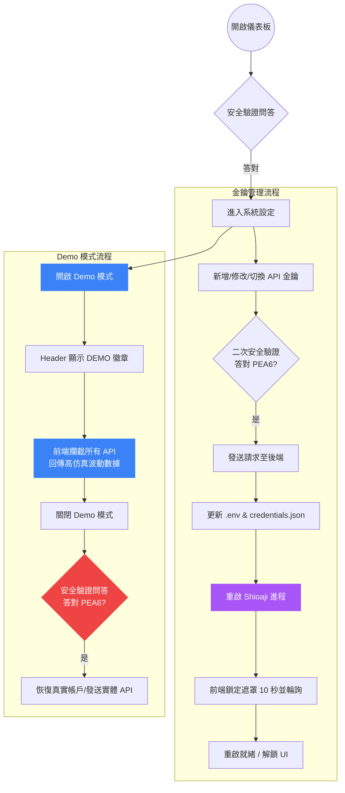

# 產品需求文件 (PRD) - API 金鑰多組管理與 Live Demo 模式 (v1.6.0)

本文件定義 StockGenie API 股票交易與資產監控儀表板 v1.6.0 版本之新增功能需求，包含 **API 憑證多組維護切換** 與 **Demo 演示模式** 兩大核心功能。

---

## 1. 專案背景與目的
StockGenie 原本僅支援單組永豐 API 金鑰與 CA 憑證（透過 `.env` 檔案手動配置）。為了提供多帳戶切換之便利性，以及在對外展示、教學、社群說明時能隱匿真實資產，本版本引進：
1. **API 金鑰與憑證多組管理**：讓使用者可在網頁前端直接新增、修改、刪除多組 API Key / Secret Key / CA 憑證路徑及密碼，並進行一鍵安全切換。
2. **Demo 演示模式**：提供高擬真假數據（含隨機波動行情與健全的歷史趨勢），可在不連接真實 API、不洩漏資產、甚至完全離線的狀態下對外說明展示。

---

## 2. 核心功能需求

### 功能一：API 帳戶與金鑰多組管理 (Multi-Profile API Management)

#### 2.1 憑證儲存與配置
- **資料儲存**：在伺服器本機端使用 `credentials.json` 檔案進行多組設定檔儲存，格式須包含：
  - `active_index`: 目前啟用的設定檔索引。
  - `profiles`: 設定檔陣列，每組設定包含：名稱、API Key、Secret Key、CA 憑證檔案絕對路徑、CA 憑證密碼。
- **安全性防護**：
  - `credentials.json` 須被加入 `.gitignore` 排除列表以防上傳至 Git（專案現已有 `*.json` 規則）。
  - 當前端要求讀取憑證列表時，後端必須對 API Key（僅保留前 6 與後 4 字元）、Secret Key 與 CA 憑證密碼進行遮蔽（例如返回 `ABCDEF...WXYZ` 或固定長度之 `●●●●●●●●`，遮蔽結果不得洩漏原始字串長度），不可將明文傳送至瀏覽器。
- **舊版相容性 (Backward Compatibility)**：若 `credentials.json` 不存在，後端啟動時應自動讀取既有之 `.env` 配置，並寫入建立預設的第一組設定檔，達成無縫升級。

#### 2.2 金鑰新增與編輯
- 提供明晰的表單，讓使用者新增或修改設定。
- 表單欄位包含：
  - 設定名稱（必填）
  - API Key（選填，若修改則不應為遮蔽格式，留空或維持遮蔽則不予更新）
  - Secret Key（選填，若修改則不應為遮蔽格式，留空或維持遮蔽則不予更新）
  - CA 憑證絕對路徑（選填）
  - CA 憑證密碼（選填，若修改則不應為遮蔽格式，留空或維持遮蔽則不予更新）

#### 2.3 設定變更之安全防護
- **變更確認安全性**：在前端執行「儲存設定」、「切換使用」、「刪除設定」時，均必須彈出「變更設定安全驗證」對話框，要求回答預設的隨機選項問題（答對 `PEA6` 才能通過）。
- **後端安全校驗**：
  - 後端 API 在執行變更時，必須在 Request Body 中夾帶並驗證 `verification_code === "PEA6"`。若驗證碼錯誤，拒絕寫入或變更並回傳 HTTP 403。

#### 2.4 子進程重啟機制
- 當使用者成功「切換使用」或「儲存變更（且為目前啟用中）」時，後端必須：
  1. 將最新的金鑰與憑證變數寫入本機 `.env`，確保其他獨立腳本（如 `monitor.py`）能同步加值使用。
  2. 自動終止原有的 `shioaji.exe` 子進程。
  3. 以新的環境變數重新啟動 `shioaji.exe` 子進程。
- 前端在接收到重啟訊號後，必須啟動「重啟中鎖定遮罩」，並以 1 秒為間隔持續檢測後端連線狀態，直到 Shioaji API 伺服器就緒後自動解除遮罩。

---

### 功能二：Demo 演示模式 (Live Demo Mode)

#### 2.1 模式切換與隱私
- 在系統設定中，提供「Demo 演示模式」開關（持久化於瀏覽器 `localStorage`）。
- 啟用 Demo 模式時：
  - 頂部天區（Header）連線狀態旁必須顯示醒目的 `DEMO` 演示徽章。
  - 前端應停止對後端 Solace 實體交易通道（即所有 `/proxy/` 端點）與本機資產歷史端點的實體 fetch 請求。
  - 改以高擬真的假數據取代，避免向任何後台發出實體金鑰交易。
- 關閉 Demo 模式時：
  - 隱藏 `DEMO` 徽章。
  - 還原發出實體請求，重新載入真實帳戶數據。
  - **切換安全**：因為關閉 Demo 模式會 reveal 真實資產，所以當使用者嘗試「關閉 Demo 模式」時，必須在前端彈出安全問答對話框，通過後才允許還原為真實帳戶模式。

#### 2.2 仿真假數據要求
Demo 模式下，畫面所呈現的數據必須全面且極其逼真，包含：
1. **可用可用餘額**：固定於接近 1,250,300 元之合理水位。
2. **交易額度**：額度上限 5,000,000 元，已用 850,000 元，可用 4,150,000 元，進度條正確顯示。
3. **庫存持倉**：初始顯示 4 檔高知名度個股持倉（下列為初始值；其後現價與損益隨輪詢以隨機漫步微幅波動）：
   - 2330 台積電 (2,000 股，均價 910.0，現價 950.0，損益 +80,000，+4.40%)
   - 2317 鴻海 (5,000 股，均價 185.0，現價 180.0，損益 -25,000，-2.70%)
   - 2454 聯發科 (1,000 股，均價 1280.0，現價 1310.0，損益 +30,000，+2.34%)
   - 2603 長榮 (3,000 股，均價 190.0，現價 198.5，損益 +25,500，+4.47%)
4. **交割款**：
   - T-0: +12,500
   - T+1: -25,000
   - T+2: +80,000
5. **月度已實現損益**：繪製近 12 個月合理起伏的條形圖。
6. **資產歷史趨勢**：繪製 90 天震盪向上、具備微幅回檔的仿真淨值折線圖。
7. **重大訊息與除權息行事曆**：返回數條仿真個股公告與配息資料。
8. **自選股波動仿真（重要）**：
   - 自選股與美股指數在輪詢時，價格必須在合理區間內微幅波動（隨機 ±0.1% ~ ±0.3%），包含漲跌幅、成交量、委買委賣力道條同步波動，展現「即時盤中」的效果。
9. **K線與分時圖渲染**：
   - 當在 Demo 模式下點擊自選股或庫存個股時，明細面板中必須能正確載入並繪製仿真的分時走勢折線與 MA 均線日線圖。
10. **下單閉環模擬**：Demo 模式下所有下單操作必須由前端虛擬攔截，不得發送實體請求。買進：模擬成交後動態增加假庫存、扣減假餘額；賣出：僅限既有假庫存之股票且股數不得超過持有量（超出時提示錯誤），成交後減少假庫存、增加假餘額。
11. **資產趨勢一致性**：90 天資產趨勢折線圖之最後一點，必須動態校準為目前「假餘額 + 假庫存市值」之總和。

---

## 3. 使用者流程 (User Flows)

---

## 4. 異常處理與邊界條件 (Edge Cases)
1. **Shioaji 重啟超時**：若重啟超過 30 秒仍未連線就緒（Shioaji 登入＋CA 驗證正常情況下即可能耗時 10 秒以上，故不採 15 秒），前端遮罩應顯示錯誤警告，並提示「請手動檢查終端機狀態或 CA 設定是否正確」，但不可讓 UI 永久卡死，提供「取消重試並返回設定」的按鈕。
2. **唯一設定檔保護**：當設定檔僅剩最後一組時，前端與後端均不允許將其刪除，以防止系統進入無配置狀態。
3. **遮蔽字元衝突**：若使用者編輯 API 金鑰時，輸入的內容與遮蔽的 placeholder（即包含 `...`、`●`、`*`）相同，後端在儲存時必須跳過此欄位，保留原本的資料。（已知限制：若真實金鑰或密碼本身含 `...`、`●`、`*`，將無法透過編輯更新該欄位，僅能刪除後重建設定檔。）
4. **離線環境**：在完全斷網或沒有開啟 `shioaji.exe` 的環境下，若直接開啟網頁，應允許使用者直接在登入與提示錯誤前，一鍵進入 Demo 模式進行介面功能預覽。
5. **啟用中設定檔保護**：不允許刪除目前啟用中的設定檔（前後端均須校驗，違反時回傳 400）；使用者須先切換至其他設定檔後方可刪除。
